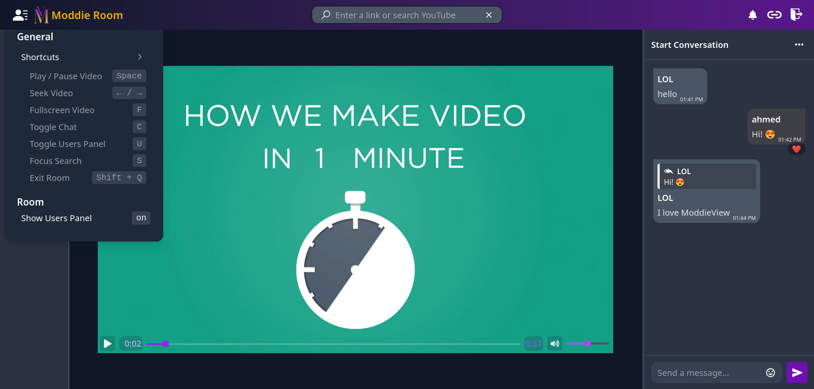

<div align="center">
  
  <h1>ModdieView</h1>
  <p>A real-time, synchronized media viewing application to watch videos together with friends.</p>
</div>

## 📖 Overview

**ModdieView** is a modern web application built to bring people together through synchronized media playback. Whether you want to watch YouTube, Vimeo, or direct video links, ModdieView ensures that everyone in the room is watching the exact same frame at the exact same time. Complete with a rich real-time chat system, it's the perfect way to share a viewing experience remotely.

## ✨ Features

- **Synchronized Playback**: Play, pause, and seek videos in perfect harmony with everyone in the room.
- **Multiple Media Sources**: Supports YouTube, Vimeo, and direct media URLs seamlessly.
- **Real-Time Chat**: Engage with other viewers instantly. Includes message reactions (emojis), message actions, and typing indicators.
- **Room Management**: Create custom rooms, join via invite links, and manage room settings.
- **Responsive UI**: Optimized layouts tailored for both Desktop and Mobile experiences.
- **Modern Design**: A beautiful, fluid interface powered by Tailwind CSS and Framer Motion animations.

## 🛠️ Tech Stack

- **Frontend Framework**: [React 19](https://react.dev/) with [Vite](https://vitejs.dev/)
- **Language**: [TypeScript](https://www.typescriptlang.org/)
- **Styling**: [Tailwind CSS v4](https://tailwindcss.com/)
- **Real-time Communication**: [Socket.IO Client](https://socket.io/)
- **State Management & Data Fetching**: [React Query (@tanstack/react-query)](https://tanstack.com/query/latest)
- **Routing**: [React Router v7](https://reactrouter.com/)
- **Media Playback**: `react-player`, `@vimeo/player`, `react-youtube`, `media-chrome`
- **Animations**: [Framer Motion](https://www.framer.com/motion/)

## 🚀 Getting Started

### Prerequisites

- [Node.js](https://nodejs.org/) (v18 or higher recommended)
- `npm` or `yarn`

### Installation

1. **Clone the repository:**
   ```bash
   git clone https://github.com/ahmniab/ModdieView.git
   cd ModdieView
   ```

2. **Install dependencies:**
   ```bash
   npm install
   ```

3. **Configure Environment Variables:**
   Create a `.env` file in the root directory based on your backend server configuration (e.g., API URLs, Socket.IO server URLs).

4. **Start the development server:**
   ```bash
   npm run dev
   ```

5. **Open the app:**
   Visit `http://localhost:5173` in your browser.

## 📁 Project Structure

```text
src/
├── assets/        # Static assets like images and global styles
├── components/    # Reusable UI components
│   ├── chat/      # Chat-related components (MessageList, ChatPanel, etc.)
│   ├── room/      # Room & video player components
│   └── ...        # Other shared components
├── contexts/      # React Context providers (Socket, Theme, etc.)
├── hooks/         # Custom React hooks
├── network/       # API integration, axios instances, and endpoints
├── pages/         # Page-level components (Home, Room)
├── types/         # TypeScript interfaces and types
└── utils/         # Helper functions and utilities
```

## 📜 Scripts

- `npm run dev`: Starts the Vite development server.
- `npm run build`: Compiles TypeScript and builds the app for production.
- `npm run lint`: Runs ESLint to check for code quality and formatting issues.
- `npm run preview`: Locally previews the production build.
